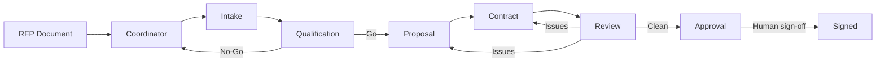

# Sales-to-Signature Multi-Agent Workflow

[](https://github.com/greglevenhagen/multi-agent-workflows/actions/workflows/ci.yml)
[](https://github.com/greglevenhagen/multi-agent-workflows/actions/workflows/codeql.yml)
[](LICENSE)
[](https://dotnet.microsoft.com/download/dotnet/9.0)

An open-source C# reference project for building a multi-agent workflow on Azure AI Foundry. The demo models a consulting firm's sales-to-signature pipeline, where an inbound RFP is parsed, qualified, priced, drafted into a proposal and contract, reviewed, and routed for approval.

## What This Repository Demonstrates

- Multi-agent orchestration using Microsoft Agents and Azure AI Foundry
- Handoff-style workflow progression across specialized agents
- Tool-backed agent steps for parsing, pricing, template lookup, and approval
- Safety controls with prompt shield, groundedness validation, and content safety
- OpenTelemetry-based tracing for local and Azure observability
- Infrastructure-as-code for provisioning the supporting Azure resources

## Architecture



### Agent Responsibilities

| Agent | Responsibility | Key tools |
| --- | --- | --- |
| Coordinator | Routes workflow state and aggregates stage output | None |
| Intake | Extracts structured opportunity details from inbound RFP text | `DocumentParser` |
| Qualification | Scores fit, risk, and delivery viability | None |
| Proposal | Generates a statement of work and pricing proposal | `TemplateLookup`, `PricingCalculator` |
| Contract | Produces legal draft output with engagement clauses | `LegalTemplateLookup`, `ClauseLibrary` |
| Review | Checks alignment between source request and contract/proposal output | None |
| Approval | Represents the human approval gate | `ApproveContract` |

## Repository Contents

```text
.
|-- data/                     Sample RFPs, pricing data, and document templates
|-- docs/                     Architecture notes and demo walkthroughs
|-- infra/                    Bicep infrastructure for Azure deployment
|-- scripts/                  Local development utilities and git hooks
|-- src/
|   |-- SalesToSignature.Agents/   Web app, agents, tools, safety, telemetry
|   `-- SalesToSignature.Tests/    Unit and integration tests
|-- .env.example
|-- CHANGELOG.md
|-- CONTRIBUTING.md
|-- SECURITY.md
`-- TRACING.md
```

## Prerequisites

- .NET 9 SDK
- Docker, if you want to run the container image locally
- Azure CLI and Azure Developer CLI if you want to provision Azure resources
- Access to Azure AI Foundry, a model deployment, and Azure Content Safety for full end-to-end execution

## Quick Start

### 1. Clone and restore

```bash
git clone https://github.com/greglevenhagen/multi-agent-workflows.git
cd multi-agent-workflows
dotnet restore src/SalesToSignature.sln
```

### 2. Configure environment variables

```bash
cp .env.example .env
```

Populate `.env` with your Azure values. The repository intentionally keeps the checked-in example file free of live secrets.

### 3. Build and test

```bash
dotnet build src/SalesToSignature.sln --configuration Release
dotnet test src/SalesToSignature.sln --configuration Release
```

### 4. Run locally

```bash
cd src/SalesToSignature.Agents
dotnet run
```

The service starts on `http://localhost:8080` by default.

### 5. Exercise the pipeline

```bash
curl -X POST http://localhost:8080/responses \
  -H "Content-Type: application/json" \
  -d '{"input":"We need 3 senior .NET developers for a 12-month Azure cloud migration."}'
```

## API Surface

| Method | Path | Description |
| --- | --- | --- |
| `GET` | `/` | Basic service metadata |
| `GET` | `/healthz` | Health endpoint for runtime probes |
| `POST` | `/responses` | Invokes the workflow and streams NDJSON events |

The `/responses` endpoint accepts `{"input":"<rfp text>"}` and emits newline-delimited JSON events as the workflow progresses.

## Sample Scenarios

The repository includes reusable examples under `data/rfps/`:

- [Acme Cloud Migration](data/rfps/acme-cloud-migration-rfp.md): straightforward approval path
- [Globex Data Platform](data/rfps/globex-data-platform-rfp.md): review loop before approval
- [Initech Advisory](data/rfps/initech-advisory-rfp.md): qualification rejection path
- [Wayne DevOps Modernization](data/rfps/wayne-devops-modernization-rfp.md): additional scenario coverage

For a presenter-oriented walkthrough, see [docs/demo-walkthrough.md](docs/demo-walkthrough.md).

## Azure Deployment

This repository includes Azure deployment assets:

- `azure.yaml` for Azure Developer CLI orchestration
- `infra/` for Bicep modules and environment parameters
- `src/SalesToSignature.Agents/agent.yaml` for the agent definition
- `src/SalesToSignature.Agents/Dockerfile` for container packaging

Typical deployment flow:

```bash
azd up
```

Review the Bicep templates before provisioning. You are responsible for Azure consumption and for selecting the right model, identity, and safety configuration for your environment.

## Safety and Observability

- Prompt shield middleware screens inbound content for prompt injection attempts
- Groundedness checks help verify outputs against source material
- Content safety filters evaluate harmful content categories
- OpenTelemetry instrumentation emits traces and metrics for local debugging and Azure monitoring

See [TRACING.md](TRACING.md) for the telemetry implementation details.

## Development Workflow

- Use feature branches and submit pull requests against `main`
- Keep changes focused and include tests when behavior changes
- Run the build and test commands locally before opening a pull request
- Check `CONTRIBUTING.md` for contribution expectations

## Project Status

This is a single-maintainer reference project. It is intended to be useful, readable, and extensible, but support and review cadence are best-effort.

## Roadmap and Non-Goals

Near-term areas that would strengthen the project:

- More deployment validation and smoke-test automation
- Expanded sample scenarios and benchmark inputs
- Deeper observability examples for Azure-hosted runs
- Broader documentation around operating costs and safety tradeoffs

Explicit non-goals:

- Providing a turnkey production SaaS application
- Supporting every Azure hosting model
- Offering guaranteed support response times

## Security

If you discover a vulnerability, follow [SECURITY.md](SECURITY.md). Do not open public issues for sensitive reports.

## Contributing

Contributions are welcome if they fit the project scope. Start with [CONTRIBUTING.md](CONTRIBUTING.md), and prefer small, focused pull requests.

## License

This project is licensed under the [MIT License](LICENSE).
