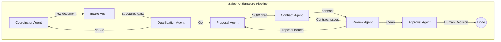
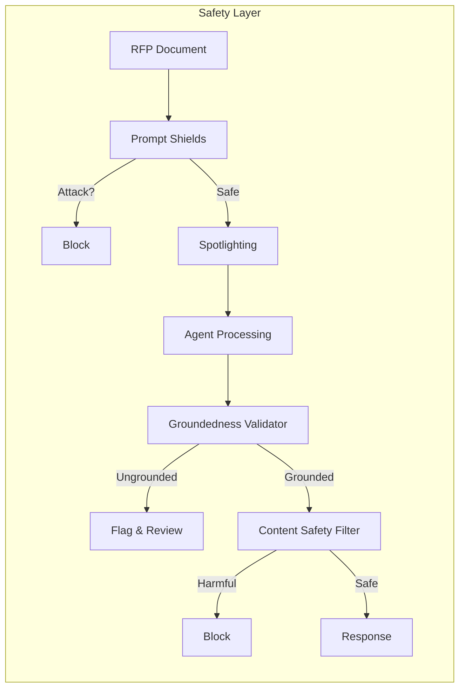

# Architecture

## Workflow Graph

## Safety Pipeline

## OpenTelemetry Spans

```mermaid
gantt
    title Pipeline Trace (Example)
    dateFormat  HH:mm:ss
    axisFormat  %H:%M:%S

    section Coordinator
    Route to Intake          :00:00:00, 1s

    section Intake
    Parse Document           :00:00:01, 2s
    Extract Fields           :00:00:03, 3s

    section Qualification
    Score Opportunity        :00:00:06, 2s
    Go/No-Go Decision        :00:00:08, 1s

    section Proposal
    Lookup Template          :00:00:09, 1s
    Calculate Pricing        :00:00:10, 1s
    Draft SOW                :00:00:11, 3s

    section Contract
    Lookup Legal Templates   :00:00:14, 1s
    Select Clauses           :00:00:15, 1s
    Generate Contract        :00:00:16, 2s

    section Review
    Cross-Check              :00:00:18, 3s

    section Approval
    Present Summary          :00:00:21, 1s
    Await Human              :00:00:22, 10s
```

## Data Flow

```mermaid
graph TD
    subgraph "JSON Payloads Between Agents"
        RFP["RFP Document<br/><i>raw markdown text</i>"] -->|string| Coord[Coordinator]
        Coord -->|string| Intake[Intake Agent]
        Intake -->|"OpportunityRecord<br/>{clientName, engagementType,<br/>budgetMin/Max, techStack,<br/>keyRequirements, confidence}"| Qual[Qualification Agent]
        Qual -->|"QualificationResult<br/>{fitScore, riskScore,<br/>revenuePotential, recommendation,<br/>dealBreakers, reasoning}"| Prop[Proposal Agent]
        Qual -->|"NoGo: reasoning"| Coord2[Coordinator]
        Prop -->|"ProposalDocument<br/>{executiveSummary, scope,<br/>deliverables[], milestones[],<br/>pricingBreakdown[], totalPrice}"| Cont[Contract Agent]
        Cont -->|"ContractDocument<br/>{contractText, standardClauses[],<br/>customClauses[], liabilityCap,<br/>paymentTerms}"| Rev[Review Agent]
        Rev -->|"ReviewReport<br/>{overallStatus: Clean,<br/>pricingConsistent: true,<br/>requirementsCovered[]}"| Appr[Approval Agent]
        Rev -->|"ReviewReport<br/>{overallStatus: IssuesFound,<br/>issues[], targetAgent}"| Cont
        Rev -->|"ReviewReport<br/>{targetAgent: proposal}"| Prop
        Appr -->|"ApprovalDecision<br/>{approved, reviewerName,<br/>feedback, contractSummary}"| Done((Done))
    end

    style RFP fill:#e1f5fe
    style Done fill:#c8e6c9
    style Coord2 fill:#ffcdd2
```

### Pipeline Stages

1. **RFP Document** → Coordinator receives raw markdown text
2. **OpportunityRecord** → Intake extracts structured data using DocumentParser tool
3. **QualificationResult** → Qualification scores fit/risk/revenue and recommends Go/NoGo
4. **ProposalDocument** → Proposal drafts SOW using TemplateLookup + PricingCalculator tools
5. **ContractDocument** → Contract generates legal package using LegalTemplateLookup + ClauseLibrary tools
6. **ReviewReport** → Review cross-checks consistency and pricing accuracy
7. **ApprovalDecision** → Approval presents summary and captures human decision via ApproveContract tool

## Key Design Decisions

### Handoff Orchestration
We use the **Handoff** pattern from Microsoft.Agents.AI.Workflows rather than Group Chat because:
- Each agent has a clear, linear role in the pipeline
- Branching is deterministic (go/no-go, clean/issues)
- The handoff pattern maps naturally to a consulting sales process

### Safety as Middleware
Safety checks (Prompt Shields, Groundedness, Content Safety) are implemented as separate classes rather than inline in agents because:
- They can be composed and reused across agents
- They can be tested independently with mocked API clients
- They can be disabled for local development without Azure credentials

### Strongly-Typed Models
All inter-agent data uses C# records with JSON serialization because:
- Compile-time type checking prevents schema drift
- `[JsonPropertyName]` ensures wire-format stability
- Records provide value equality and immutability
